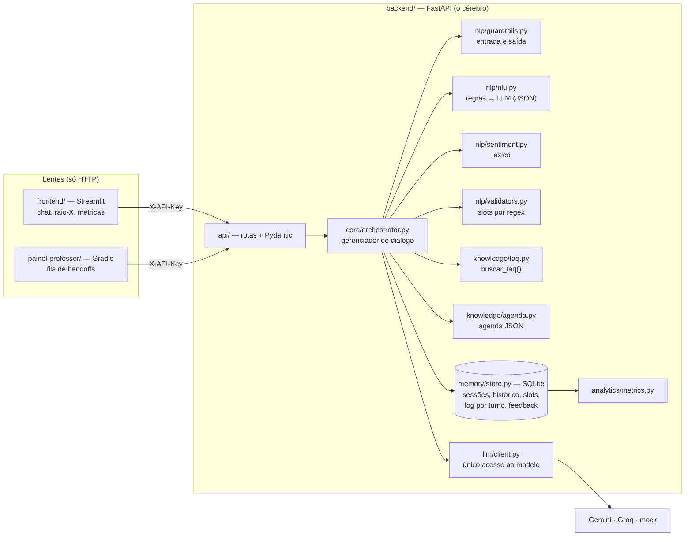

# Lia — Bot como Serviço

Checkpoint integrado de Front-end e PLN · FIAP · 2º semestre de 2026

> Os trechos marcados com ✏️ precisam ser preenchidos pelo grupo antes da entrega.

## 1. Integrantes

| Nome | RM |
|---|---|
| Murilo Benhossi | 562358 |
| Nicolas Lemos Ribeiro | 553273 |
| Ricardo de Paiva Melo | 565522 |
| Luís Fernando de Oliveira Salgado | 561401 |
| Pedro Leal Murad | 565460 |
| Jonas Alaf | 566479 |

## 2. O caso e o bot

A **Lia** é a assistente virtual da oficina de chatbots. Ela nasceu no Build Day como um MVP em Next.js
([repositório original](https://github.com/9luis7/lia-chatbot-oficina)), que respondia a uma FAQ de sete temas,
guardava o objetivo de aprendizagem escolhido e já separava regras de geração de texto. Toda a memória, porém,
vivia no navegador: recarregar a página apagava a conversa.

Neste checkpoint a Lia virou um **serviço**. O cérebro mora num backend FastAPI e qualquer tela é só uma lente.
Ela agora:

- tira dúvidas sobre 11 temas da oficina, respondendo apenas com base numa FAQ curada;
- **agenda plantão de dúvidas com o professor** (fluxo com nome, RM, e-mail, tema e horário validados por código);
- transfere a conversa ao professor com um resumo estruturado quando o aluno pede, se frustra, traz um tema
  sensível ou quando ela falha duas vezes seguidas;
- recusa ataques ao prompt e pedidos para fazer a atividade pelo aluno.

A ficha completa está em [`docs/ficha_do_bot.md`](docs/ficha_do_bot.md). As métricas estão em
[`docs/metricas.md`](docs/metricas.md); os problemas encontrados nas conversas manuais e as correções, em
[`docs/rodada1_achados.md`](docs/rodada1_achados.md).

## 3. Arquitetura



**Ordem de decisão de cada turno** (evolução da ordem do Build Day "validação → handoff → FAQ → Gemini → fallback"):

1. guardrail de entrada (tamanho, prompt injection, pedido para fazer a atividade);
2. resposta a uma oferta de handoff pendente;
3. handoff por regra (pedido explícito, tema sensível, frustração);
4. fluxo de agendamento em andamento;
5. intenção: regras primeiro, LLM só se nada casar;
6. fallback com opções; na segunda falha seguida, oferta do professor.

O painel raio-X do front mostra qual dessas etapas decidiu cada resposta.

## 4. Contrato da API

Documentação interativa completa em **http://localhost:8000/docs** (botão *Authorize* para informar a chave).
Todas as rotas exigem o header `X-API-Key`, exceto `/health`.

| Método | Rota | Para quê |
|---|---|---|
| GET | `/health` | Estado da API, provedor e modelo em uso |
| POST | `/sessions` | Cria a sessão; devolve `session_id` e a saudação |
| POST | `/chat` | `{session_id, message}` → resposta + raio-X (intent, slots, sentiment, fallback, handoff, route, guardrail, latency_ms) |
| POST | `/chat/stream` | Mesma conversa em streaming (SSE) |
| GET | `/sessions/{id}` | Histórico, slots, etapa do fluxo, resumo rolante e handoff |
| DELETE | `/sessions/{id}` | Direito ao esquecimento (LGPD) |
| GET | `/metrics` | Contenção, fallback, handoff, mensagens por conversa e extras; filtros para o A/B |
| POST | `/feedback` | CSAT de 1 a 5 |
| GET | `/handoffs` | Fila do professor, urgentes primeiro |
| PATCH | `/handoffs/{id}` | Professor assume ou resolve o caso |

Códigos: 200/201 sucesso, 401 chave ausente ou errada, 404 `session_id` inexistente, 422 requisição inválida,
503 modelo indisponível (com mensagem pronta para a tela).

## 5. Tecnologias e modelo de linguagem

**Backend:** Python, FastAPI, Pydantic, pydantic-settings, httpx, SQLite, pytest.
**Frontend:** Streamlit (chat, raio-X, métricas), Plotly, httpx. **Segunda lente:** Gradio.

**Modelo:** `openai/gpt-oss-120b` no **Groq** como modelo principal, com o Gemini `gemini-3.5-flash-lite` como
**reserva** (assume se o Groq falhar). O **juiz** do LLM-as-judge no A/B publicado foi o `qwen/qwen3.8-27b`
(família Qwen, da Alibaba), rodando no Groq: mesmo provedor do bot, mas família de modelo diferente. O juiz
automático do código (`--juiz auto`) escolheria o Gemini, mas a cota gratuita dele não comportava as 36
avaliações, por isso usamos o Qwen. Trocar de provedor é mudar `LLM_PROVIDER` no `.env`. O provedor `mock` roda sem chave e sem internet: é o que os testes usam.

**Como chegamos aqui.** O MVP do Build Day usava Gemini Flash. No primeiro teste real (01/10/2026) o alias
`gemini-flash-latest` apontava para um modelo com cota gratuita de 20 requisições e respondia 503 por excesso
de demanda; o `llama-3.3-70b-versatile` do Groq, que planejávamos usar, tinha saído do catálogo. Medimos então
cada candidato com `scripts/diagnostico_llm.py` (texto, JSON e function calling):

| Modelo | Texto, JSON e ferramentas | Latência por chamada (01/10/2026) |
|---|---|---|
| Groq `openai/gpt-oss-120b` | ok | 1,6 a 4,6 s |
| Gemini `gemini-3.5-flash-lite` | ok | 7,4 a 14,7 s |
| Gemini `gemini-2.5-flash-lite` | indisponível para contas novas | — |

Usamos versões fixas de propósito: um alias "-latest" troca de modelo, e de cota, sem avisar.

**Justificativa (seção 5.4):**
- **Custo:** zero. As duas APIs têm camada gratuita sem cartão, e a Lia só chama o modelo quando precisa
  (respostas de FAQ, intenções que as regras não entendem e consulta à agenda). Fluxo, validação, handoff e
  guardrails não gastam token.
- **Latência observada:** o Groq respondeu entre 1,6 e 4,6 s por chamada, contra 7 a 15 s do Gemini no mesmo
  dia, e foi isso que decidiu o modelo principal. Por turno, nas conversas manuais, a média ficou em 297 ms e o
  p95 em 1,1 s, porque 83% das intenções foram resolvidas por regra, sem chamar o modelo (`docs/metricas.md`).
- **Qualidade em português:** ✏️ (uma frase do grupo, comparando com a discussão de modelos em PT do 1º semestre
  e com o que o juiz e as conversas mostraram).

A disciplina recomenda modelo local (Ollama). ✏️ (uma frase do grupo explicando por que optaram pela API, por
exemplo, o hardware disponível. O acesso ao modelo está isolado em `llm/client.py`, então trocar para um endpoint
local compatível com a API da OpenAI exige só uma nova entrada no dicionário de provedores.)

**Limites do plano gratuito** (valem por projeto ou organização, não por chave; consultados nos consoles em 03/10/2026):
- Groq, `openai/gpt-oss-120b`: 30 requisições por minuto, 1.000 por dia, 8.000 tokens por minuto e 200.000
  tokens por dia (fonte: https://console.groq.com/settings/limits).
- Gemini, `gemini-3.5-flash-lite`: 15 requisições por minuto, 500 por dia e 250.000 tokens por minuto (fonte:
  https://aistudio.google.com/rate-limit; a [página oficial](https://ai.google.dev/gemini-api/docs/rate-limits)
  avisa que os valores mudam por modelo). Na mesma consulta, os modelos Gemini Flash sem "lite" (2.5, 3 e 3.5)
  tinham limite de 20 requisições por dia, o que explica a cota estourada no primeiro teste real com o alias
  `gemini-flash-latest`.
- **Resiliência:** em 503, 429 ou timeout o backend espera e tenta de novo (`LLM_RETRIES`). Se o provedor
  continuar fora, a mesma chamada vai para o reserva (`LLM_FALLBACK_PROVIDER=gemini`). Só se os dois falharem
  a API devolve 503, e a tela mostra que o modelo está indisponível. O 503 *high demand* do Gemini no nosso
  primeiro teste real foi o que motivou o reserva. O campo `model` do raio-X e do log mostra qual modelo respondeu de fato.
- `python scripts/diagnostico_llm.py` testa texto, JSON e function calling no provedor e mostra a resposta crua.

## 6. Como executar

Requisitos: Python 3.11 ou superior. São três projetos independentes, cada um no seu terminal e com seu próprio
ambiente virtual. No Mac, se `python` não existir, use `python3` (ou `python3.13`).

### 6.1 Backend (o cérebro), terminal 1

```bash
cd backend
python -m venv .venv
source .venv/bin/activate          # Windows: .venv\Scripts\activate
pip install -r requirements.txt
cp .env.example .env               # Windows: copy .env.example .env
```

Abra o `.env` e preencha:
- `API_KEY`: qualquer texto; é a senha que as telas vão usar;
- `GROQ_API_KEY`: gere em https://console.groq.com/keys (gratuito; é o modelo principal);
- `GEMINI_API_KEY` (recomendado, para o reserva e o juiz): gere em https://aistudio.google.com/apikey.

Sem chave nenhuma, use `LLM_PROVIDER=mock`: tudo funciona, com as respostas da FAQ sem reescrita pelo modelo.

```bash
uvicorn app.main:app --port 8000
```

Confira em http://localhost:8000/docs.

### 6.2 Frontend (a lente), terminal 2

```bash
cd frontend
python -m venv .venv
source .venv/bin/activate
pip install -r requirements.txt
cp .env.example .env               # API_KEY igual à do backend
streamlit run app.py
```

Abre em http://localhost:8501. A página **Métricas** fica no menu lateral.

### 6.3 Painel do professor (segunda lente, opcional), terminal 3

```bash
cd painel-professor
python -m venv .venv
source .venv/bin/activate
pip install -r requirements.txt
cp .env.example .env               # API_KEY igual à do backend
python app.py
```

Abre em http://localhost:7860.

### 6.4 Testes e avaliação

```bash
cd backend
python -m pytest -q                        # 252 testes, incluindo T1–T8, sem chave e sem internet
python scripts/ab_test.py --julgar         # A/B v1 × v2 com LLM-as-judge (backend rodando)
```

Detalhes dos scripts em [`backend/README.md`](backend/README.md).

## 7. Decisões regra × LLM

**1. Fallback e handoff são decididos por regra, nunca pelo modelo.** Herdada do Build Day. Se o LLM decidisse
quando transferir, um aluno em crise poderia receber uma resposta criativa em vez do professor. Por isso pedido de
humano, tema sensível, frustração e falhas repetidas são detectados em código, antes de qualquer chamada ao modelo,
e têm precedência sobre a FAQ e sobre o fluxo. Evidência: T2 e T7.

**2. Intenção híbrida: regras primeiro, LLM só quando nada casa.** As regras cobrem o que não pode errar
(agendar, cancelar, falar com o professor) e as perguntas com palavras-chave da FAQ, com custo zero e latência
de milissegundos. Quando nenhuma regra casa, o LLM classifica a mensagem com saída em JSON entre FAQ, fora da base,
fora do escopo e não entendi. Isso reduz os fallbacks de paráfrases sem entregar ao modelo as intenções críticas.
Evidência: conversa E2 do A/B e o gráfico "quem classificou a intenção" no painel de métricas.

**Variações de linguagem como dados.** Nas conversas manuais, várias respostas curtas e naturais caíam em
fallback ("n precisa", "vlw", "Sim" depois de uma oferta, "não tô entendendo nada", "Oi, sou Eduarda"). Em vez de
remendar o código caso a caso, as expressões ficam em `backend/data/variacoes.json`: cerca de 580 expressões em 11
categorias (despedida, recusa, aceite, confusão, saudação, capacidades, identidade, pedido do professor, repetir,
elogio e ofensa), cada uma com um comportamento próprio. O código normaliza acentos, expande abreviações de chat
(n → não, vlw → valeu, qnd → quando) e compara com a mensagem **inteira**, para "não" não capturar "não sei o que
é slot". As palavras-chave da FAQ também ganharam sinônimos e conjugações ("alucine", "esquece", "indicadores").
Qualquer pessoa do grupo pode ensinar uma variação nova editando o JSON, sem mexer em código.
`tests/test_variacoes.py` mede essa cobertura com 119 frases escritas de forma livre (121 testes no total) e
garante que nenhuma expressão está em duas categorias. A/B v2 com o modelo real, sem juiz, em 03/10/2026
([`ab_20261003_1849.md`](backend/scripts/resultados/ab_20261003_1849.md)): 18 conversas, acerto do roteiro 100%,
acerto em paráfrases 100%, fallback 6%, latência média 166 ms, nenhuma verificação falhou.

**Robustez a erros de digitação e classificador LLM com confiança.** Uma revisão da arquitetura apontou que a
camada flexível era estreita: erros como "slto" ou "profssor" escapavam das regras, e o classificador LLM só podia
responder "FAQ", "fora da base", "fora do escopo" ou "não entendi", sem conseguir reconhecer um pedido de
professor ou de agendamento. Três mudanças, sem dependência nova:
- **Correção ortográfica controlada** (`nlp/ortografia.py`, com `difflib`): só corrige para palavras do
  vocabulário da Lia, exige a mesma primeira letra e quase o mesmo tamanho, e nunca toca em números, e-mails ou
  nos dados do agendamento (validados sobre o texto original). O raio-X mostra o texto interpretado.
- **Classificador com as 17 intenções**, recebendo um resumo de cada FAQ e o estado da conversa. Ele só
  classifica; o código decide pela confiança: FAQ acima de 0,75 é respondida, entre 0,5 e 0,75 a Lia pergunta
  "Você quis perguntar...?"; professor e tema sensível acima de 0,75 vão para o professor (errar aí só chama uma
  pessoa à toa); agendar apenas abre o fluxo; **cancelar nunca é executado pelo LLM sem confirmação**.
- **Testes antes do código:** `tests/test_robustez.py` mediu 6 de 23 frases com erro entendidas por regra antes
  da mudança e 23 de 23 depois, com testes negativos para falsos positivos ("estudando" não pode virar
  "testando"). `scripts/robustez.py` mede o mesmo com o modelo real, incluindo paráfrases.
  Ficaram para depois da entrega: busca semântica com embeddings e variação de estilo das respostas.
- **Resultado com o modelo real** (02/10/2026,
  [`robustez_20261002_1609.md`](backend/scripts/resultados/robustez_20261002_1609.md)): 20 de 23 (87%).
  Digitação 9 de 10 (90%), paráfrase 8 de 10 (80%), mistura 3 de 3 (100%). Os três erros:
  - "quero cancleat meu plantao": esperado `cancelar`, obtido `consultar_agendamento` (regra);
  - "qual a parte mais importante pra começar a montar o bot?": esperado FAQ `happy-path`, obtido FAQ
    `minimum-checklist` (LLM);
  - "o bot pode responder qualquer coisa que o modelo quiser?": esperado FAQ `rule-versus-llm`, obtido
    `capacidades` (LLM).

**3. O agendamento é um fluxo determinístico; o LLM só consulta a agenda.** Horário de plantão é compromisso
com o professor, então nunca pode ser inventado. Os slots são validados por regex e a confirmação é por regra.
Quando o aluno pergunta "tem horário na quinta?", o LLM decide chamar a ferramenta `consultar_agenda` (function
calling), mas quem lê o JSON e devolve os horários é o código. Evidência: T1, T4 e E3.

**4. O guardrail de saída pode descartar a geração.** Se a resposta do modelo vazar o prompt ou prometer nota,
prazo ou contato com o professor, o código troca o texto pela resposta curada da FAQ e registra o evento no log.

### Memória: por que N = 6 turnos

A cada turno o backend monta `system + resumo + últimos 6 turnos + nova mensagem`. Com entradas limitadas a 500
caracteres e respostas de até quatro frases, seis turnos ficam na casa de 2 mil tokens por chamada, o que cabe
com folga nos limites por minuto do plano gratuito. É também o suficiente para as continuações do tipo
"e por quê?", que dependem só dos últimos turnos. O que sai da janela não se perde: vira um **resumo rolante**,
gerado em lotes de quatro mensagens para economizar chamadas. E os dados que não podem se perder não dependem
da janela: no T3, o horário marcado dez turnos antes vem dos slots, guardados no estado da sessão.

## 8. Limitações conhecidas

- O handoff é uma fila simulada: o professor só vê o caso se abrir o painel; não há e-mail nem notificação.
- A agenda é um JSON com datas fixas e o RM não é conferido com a FIAP; os nomes usados nos testes são fictícios.
- Os guardrails de entrada usam regex: uma formulação criativa pode passar. A camada 3 do system prompt é a
  segunda barreira, e o guardrail de saída, a terceira.
- O sentimento por léxico não entende ironia nem gírias fora da lista.
- O streaming envia a resposta em pedaços **depois** de o guardrail de saída aprovar o texto completo. Foi uma
  escolha: um streaming direto do modelo mostraria ao aluno um texto que ainda poderia ser bloqueado.
- O 503 só aparece quando a resposta depende do modelo (FAQ). Fluxo, handoff e guardrails continuam funcionando
  com o modelo fora do ar, e a consulta à agenda cai para uma listagem por regra.
- O SQLite atende um processo só; para vários servidores seria preciso um banco externo.
- O provedor `mock` não entende paráfrases: sem chave, a conversa E2 cai em fallback.

## 9. Divisão de responsabilidades

✏️

| Integrante | Responsabilidade |
|---|---|
| | |

## 10. Uso de IA generativa

✏️ Revisem e ajustem este texto para refletir exatamente o que aconteceu.

O grupo usou o **Claude (Anthropic)** como apoio em:
- análise do enunciado e do repositório do Build Day, e proposta da arquitetura;
- geração de código do backend, do frontend, do painel e dos scripts de avaliação, a partir das decisões do grupo;
- escrita dos testes automatizados e revisão dos diálogos do bot;
- rascunho deste README e da ficha do bot.

✏️ O grupo também usou o **ChatGPT (OpenAI)** para revisar a arquitetura e propor a melhoria do classificador.

O grupo validou a arquitetura antes da implementação, executou o sistema com o modelo real, rodou os testes
T1–T8 e as conversas de avaliação, e escreveu a leitura crítica e a proposta de melhoria do `docs/metricas.md`.
Todos os integrantes conseguem explicar qualquer parte do código.

**O que foi adaptado de fora:** a lógica de normalização, busca na FAQ e detecção de handoff e de continuação
vem do repositório do Build Day do próprio grupo. As definições de métricas, a arquitetura de referência e o
formato da ficha seguem o material das Aulas 2, 3 e 4.
